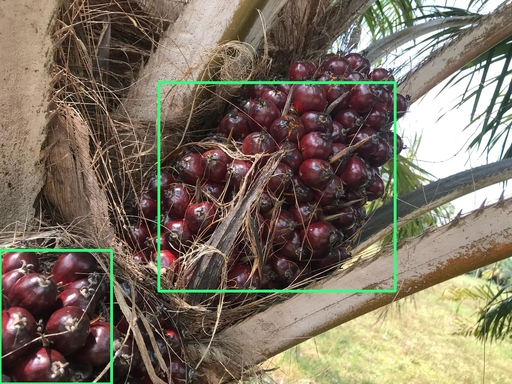
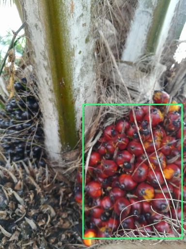

# Watering Bot

[](https://www.codefactor.io/repository/github/kanokkorn/marimo)

## Goal

This project is to demonstrate how autonomous agriculture should be in my dream. I know in reality it's hard but I am working for it.

The crucial point of this robot aims to be is

* Can operate __without__ __any__ human interaction
* Work in __every__ __condition__, even if no internet connection
* Smart enough to __decide__ what it should do when an unexpected thing happened
* Can be work independently or group, __without__ __reconfiguration__
* __Easy__ to use interface

## How it works

This flow will show how the system works

```text
                   +--------------+
                   |              |
                   | sensor suite |
                   |              |
                   +---+------+---+
                       ^      |
                       |      |
                       |      v
+----------+       +---+------+---+       +-----------+
|  control +<------+              +------>+           |
|          |       | Robot Server |       | local sql |
|   unit   +------>+              +<------+           |
+----------+       +---+------+---+       +-----------+
                       ^      |
                       |      |
                       |      v
                   +---+------+---+
                   |              |
                   |  interface   |
                   |              |
                   +--------------+
```

The robot takes command from the user interface. Just set up one time. Then tell the robot what it should do, where it should go. The robot will take care of the rest of the tasks. Tasks can be repetitive. It depends on what you do.

When a command is sent. The robot will execute the command. In this case, the robot is programmed to follow waypoint from GPS coordinates and watering plants.

### Interface

The interface is written with HTML and host on the robot server. So you don't have to install anything on the computer.

### Control unit

The Control unit is how the robot moves through the terrain and such. It designed to be modular for a different type of platform like 4WD, track, legs, etc.

### Local SQL

The robot stores data locally and can exchange with other robots and servers if needed.

### Sensor suite

The sensor suite is where the robot sees and commutes with other robots, basically contain a camera, Narrowband transmitter, gyroscope, and ultrasonic.

### Robot server

The robot server is the core of this project. The server computes PID, path planning, analyze an image from the camera, and decision making. With some machine learning and deep learning tricks.

## Screenshot

Example 1: Detecting palm fruits





## Install

This project designed to work with ARMv7 based processor, if you use x86_64 or ARM64 some modules need to recompile.

### Prerequisite

* Micro SD Card (16GB+ is recommend)

* [Raspbian](https://www.raspberrypi.org/downloads/raspbian/) without Desktop Environment (Desktop Environment is ok if you don't like using a terminal.)

* Arduino Uno R3

* USB Camera (For now. We planned to use the CSI type camera.)

## Usage

TBD

## License

Watering_robot is under license [MIT](https://github.com/kanokkorn/watering_robot/blob/master/LICENSE)
